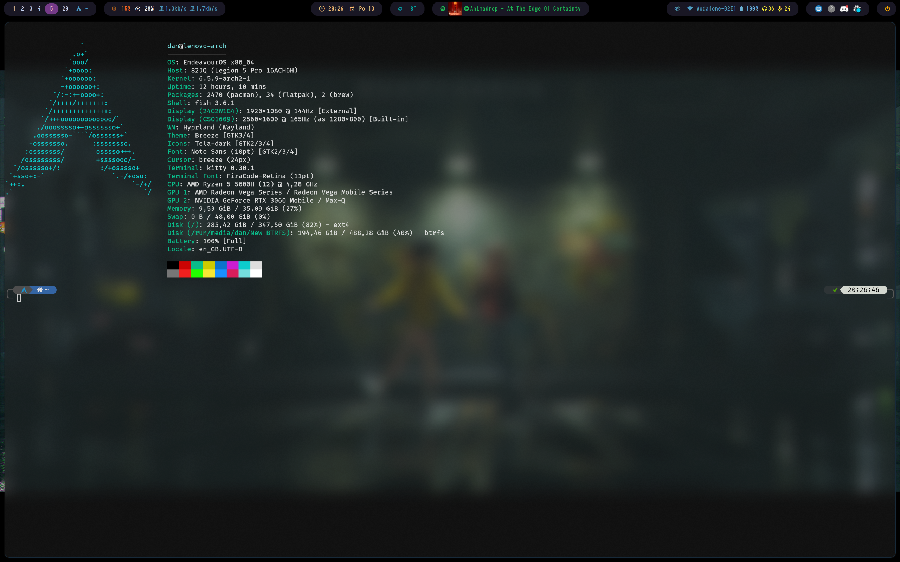
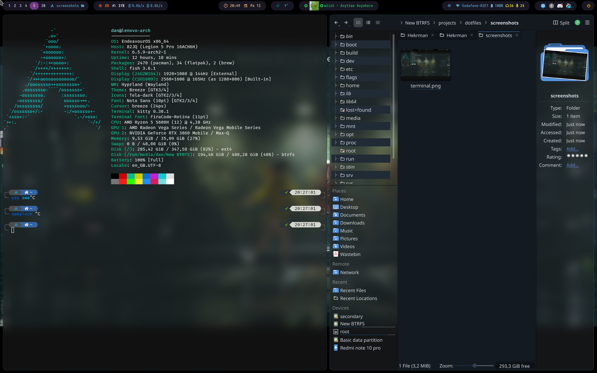
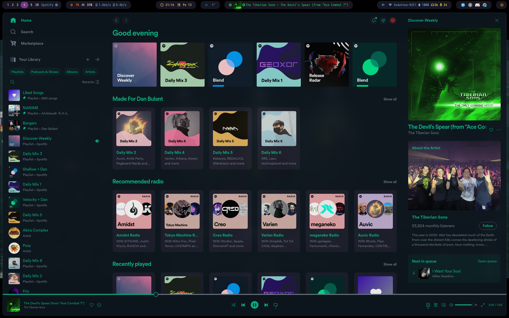

# Dotfiles

My dotfiles. Moved from KDE plasma config to hyprland.

super key = windows key

Please do edit configuration of at least hyprland - default configuration is very specific to my setup (involves monitor scaling)

## Screenshots

## Used software

I'm using Arch linux.

- hyprland - wayland compositor and window manager (also adds blur and rounded corners). Really barebones, see below for shortcuts (read the config file for up to date shortcuts)
- fish - shell (friendly, interactive, doesn't implement POSIX, I recommend reading it's docs first)
- fastfetch - everyone needs a fetch program
- onefetch - fetch for git repos (fish is configured to show repo details when you cd into a repo)
- kitty - terminal emulator (GPU accelerated, supports ligatures, unicode, etc)
- nano - simple text editor. I recommend editing duplicating the file to root's home directory and changing the colors there, so you always see when you're sudo editing something.
- nushell - for scripting and data management - I don't use it and it's not required for the current setup, but I'm planning to use it in the future.
- rofi - application launcher, general "chooser" (used for power menu, notification actions, etc)
- waybar - the top status bar
- lightly (AUR) - QT theme, set it via `qt5ct`. Adds blur to *most* QT apps, but mainly also improves the general look and feal of QT apps. Some blur is broken on wayland.
- hyprlock - Fancy lock screen
- spicetify - custom spotify theme
- VSCode - code editor. Current theme/config is not in dotfiles here, but the theme used is Atom One Dark, and the font is Fira Code.
- dolphin - file browser
- polkit-kde-authentication-agent-1 - required for sudo gui prompts (like when you open dolphin as root)
- blueman-applet - bluetooth app indicator
- swaybg - for showing wallpaper
- activity-watch and awatcher - for program usage statistics
- nm-applet - network manager app indicator
- swayidle - for automatic locking
- pam_kwallet_init - for storing secrets in kwallet

For base setup, only `hyprland`, `rofi`, `waybar` and `swaylock`/`swaylock-effects-git` is required.

## General notes

### Lock screen

Lock screen doesn't show what you type, it just changes it's circle for each character. If you delete all the input, it will show "cleared".  
Click the crossed eye on the status bar (next to network connection status, on the right side) to disable automatic lock screen (for playing videos, etc, as idle detection is not perfect on hyprland). If it's purple and shows normal eye, automatic lockscreen is disabled.

### Terminal

Kitty is a very basic terminal emulator, but it supports GPU acceleration, ligatures, unicode, etc.  
See kitty under shortcuts for shortcuts. Note that even though it supports scrolling, it doesn't show a scrollbar.

### Hyprland

Is a barebones wayland compositor and window manager. It's main features are blur and rounded corners.

By default, it can't do much, but it's very configurable. See the config file for more info.

For mouse controls, press super key and drag with left click to move the window. Use right click to resize. Super key and scroll switches desktops.  
Hovered window has support, switching active window also moves the cursor.

Supports touchpad gestures (mainly swiping with 3 fingers to switch desktops).

Each monitor has it's own desktop and switches desktop independently.

Hyprland has groups - multiple programs can be grouped together and are then tabbed. The tabs are yellow as I couldn't find relevant working config :(.  
super+g toggles group, super+shift+left/right switches tabs (also loops over).

Hyprland has hyprctl for viewing data about `monitors` and `clients` (windows). You can use it to find relevant IDs and classes.

## Shortcuts

Set to roughly mirror KDE/Windows when possible, unless I either didn't know the shortcut or there was no such shortcut available.

### Opening stuff

| Shortcut | Action |
| --- | --- |
| super + t | Open terminal (kitty) |
| super + r | Open application launcher (rofi) |
| super + e | Open file browser (dolphin) |
| super + p | Power menu (rofi) |
| super + b | Open browser (vivaldi) |

My current setup is set that power button turns off the computer without prompting, so maybe beware of that ;)

### Windows

| Shortcut | Action |
| --- | --- |
| super + q | Close window |
| super + g | Toggle group |
| super + v | Toggle floating of current window |
| super + f | Toggle fullscreeen |
| super + a | Swaps workspaces between monitors |
| super + alt + arrows | Switch focus between windows (arrows indicate direction) |
| super + 1-9/0 | Switch to workspace 1-10 (workspaces are numbered from 1, 0 = workspace 10) |
| super + left/right | Move window between monitors (and their workspaces) |
| super + m | Swaps master window, i.e. the window on the left, with the current window |

### Other

ctrl+alt 1/2 is passed on to OBS as a global shortcut. You may want to change this, but it can also serve as an example of a global shortcut.
