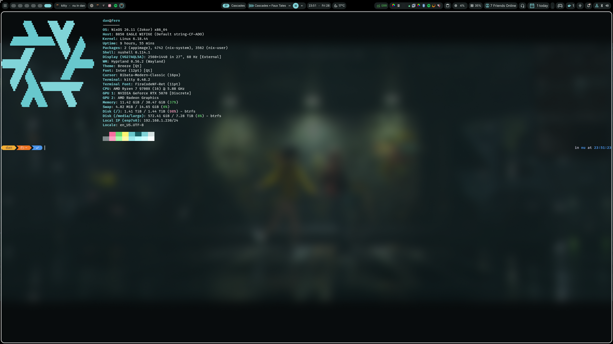

# Dotfiles

My dotfiles and Nix setup for Hyprland and some other goodies.

## Screenshots

## Systems

- Fern, as the main PC
  - Gaming, backups, AMD CPU, nvidia GPU, AI models
  - Most used, most stable
- Eisen
  - Intel laptop
  - Home server
- Aura, as my main laptop
  - Intel laptop

## Used software

I'm using NixOS. For the full package list, see
[`home.nix`](./servers/ui-mode/home.nix).

- hyprland - wayland compositor and window manager (also adds blur and rounded corners). Really barebones, see below for shortcuts (read the config file for up to date shortcuts)
- ~~fish - shell (friendly, interactive, doesn't implement POSIX, I recommend reading it's docs first)~~
- nushell - shell (very different)
- fastfetch - everyone needs a fetch program
- onefetch - fetch for git repos (fish is configured to show repo details when you cd into a repo)
- kitty - terminal emulator (GPU accelerated, supports ligatures, unicode, etc)
- Dank Material Shell - desktop shell, status bar, launcher, and notifications
- hyprlock - Fancy lock screen
- ~~spicetify - custom spotify theme~~
- Zed - code editor
- Zen - browser
- dolphin - file browser
- blueman - bluetooth app indicator
- swaybg - for showing wallpaper
- activity-watch and awatcher - for program usage statistics
- nm-applet - network manager app indicator

## General notes

### Lock screen

Lock screen doesn't show what you type, it just changes it's circle for each character. If you delete all the input, it will show "cleared". Escape clears input.  
Click the crossed eye on the status bar (next to network connection status, on the right side) to disable automatic lock screen (for playing videos, etc, as idle detection is not perfect on hyprland). If it's purple and shows normal eye, automatic lockscreen is disabled.

### Terminal

Kitty is a very basic terminal emulator, but it supports GPU acceleration, ligatures, unicode, etc.  
See kitty under shortcuts for shortcuts. Note that even though it supports scrolling, it doesn't show a scrollbar.

### Hyprland

For mouse controls, press super key and drag with left click to move the window. Use right click to resize. Super key and scroll switches desktops.  
Hovered window has support, switching active window also moves the cursor.

Supports touchpad gestures (mainly swiping with 3 fingers to switch desktops).

Each monitor has it's own desktop and switches desktop independently.

## Shortcuts

Set to roughly mirror KDE/Windows when possible, unless I either didn't know the shortcut or there was no such shortcut available.

### Opening stuff

| Shortcut | Action |
| --- | --- |
| super + t/super + k | Open terminal (kitty) |
| super + r | Open application launcher (dms) |
| super + e | Open file browser (dolphin) |
| super + p | Power menu (dms) |
| super + b | Open browser (zen) |

My current setup is set that power button turns off the computer without prompting, so maybe beware of that ;)

### Windows

| Shortcut | Action |
| --- | --- |
| super + q | Close window |
| super + g | Toggle group |
| super + v | Toggle floating of current window |
| super + f | Toggle fullscreeen |
| super + a | Swaps workspaces between monitors |
| super + alt + arrows | Switch focus between windows (arrows indicate direction) |
| super + 1-9/0 | Switch to workspace 1-10 (workspaces are numbered from 1, 0 = workspace 10) |
| super + left/right | Move window between monitors (and their workspaces) |
| super + alt + m | Swaps master window, i.e. the window on the left, with the current window |

### Other

ctrl+alt 1/2 is passed on to OBS as a global shortcut. You may want to change this, but it can also serve as an example of a global shortcut.
Of note, obs isn't installed - nixos tries to build it manually for some reason. I use comma to one-time-install obs (`, obs`).
